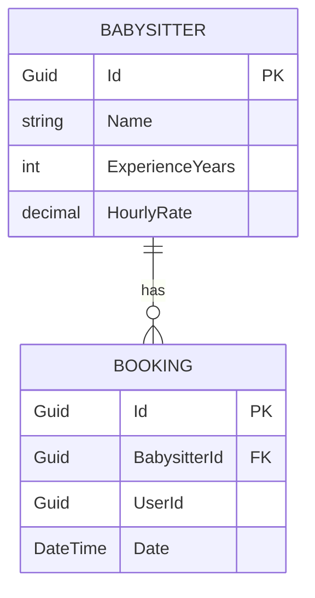
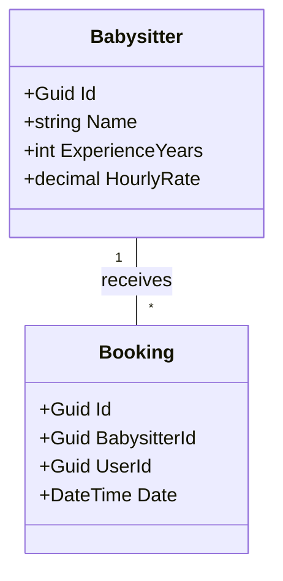
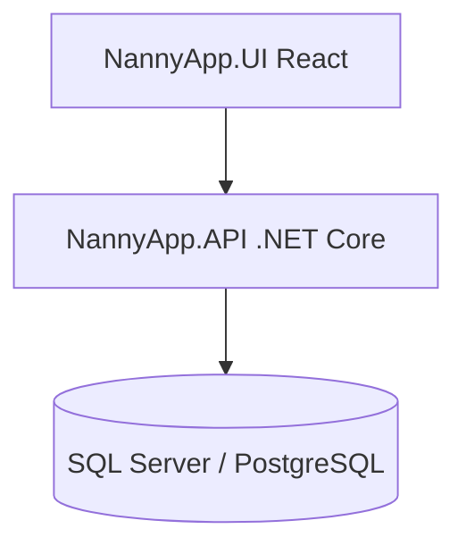
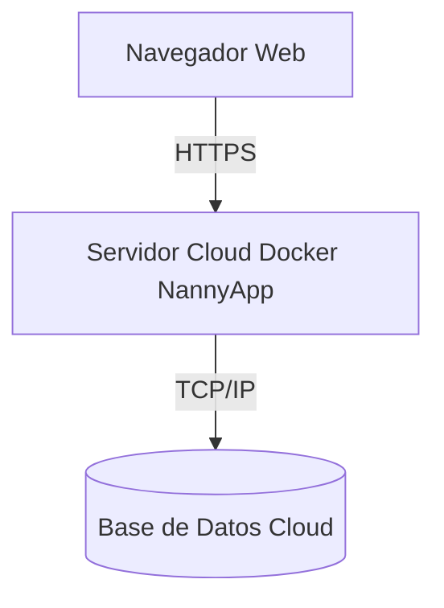

# Documentación del Sistema

## Diccionario de Datos

| Tabla | Campo | Tipo | Descripción |
|---|---|---|---|
| Babysitter | Id | Guid | Identificador único |
| Babysitter | Name | String | Nombre de la niñera |
| Babysitter | ExperienceYears | Int | Años de experiencia |
| Babysitter | HourlyRate | Decimal | Tarifa por hora |
| Booking | Id | Guid | Identificador único |
| Booking | BabysitterId | Guid | FK de la niñera |
| Booking | UserId | Guid | ID del usuario |
| Booking | Date | DateTime | Fecha de la reserva |

## Diagrama Entidad-Relación

## Diagrama de Clases

## Diagrama de Componentes

## Diagrama de Despliegue

